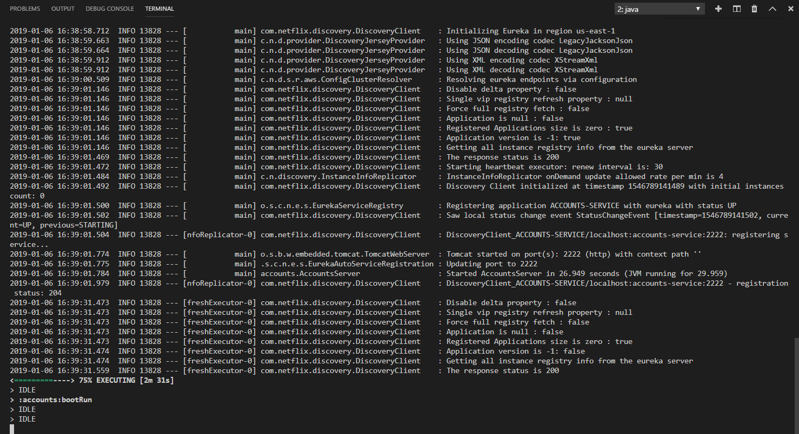

# Documentation

**T1**: The two microservices are running and registered (two terminals, logs screenshots).

Accounts microservice:

Web Microservice:

**T2**: The service registration service has the two microservices registered (a third terminal, dashboard screenshots)

dashboard with Accounts and Web Microservices 

**T3**: A second account microservice is running in the port 4444 and it is registered (a fourth terminal, log screenshots).

changing port (from 2222 to 4444) on the file (accounts/src/main/resources/application.yml)

running a second account microservice on port 444

Dashboard with 2 Accounts and 1 Web Microservices 

**T4**: A brief report describing what happens when you kill the microservice with port 2222. Can the web service provide information about the accounts? Why?

yes,because we have configurated a second account microservice on port 4444 that replace the first if it falls

